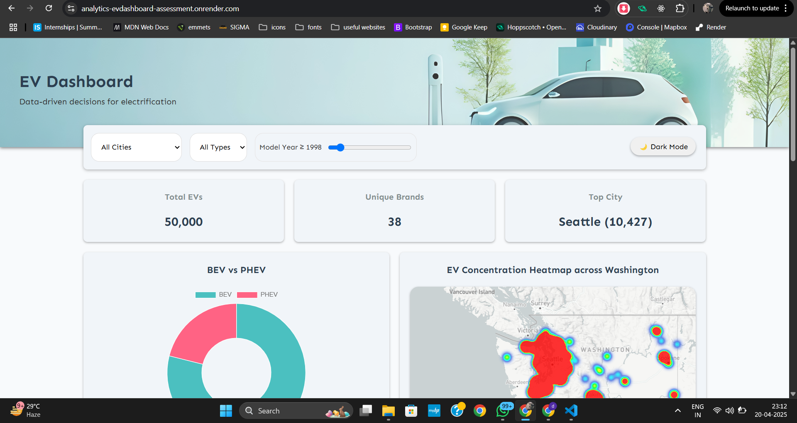

# Screening Test – Summer Internship under Dr. Abhijit Chandra - Analytics Dashboard Assessment

🔗 **Live Demo:** [analytics-evdashboard-assessment.onrender.com](https://analytics-evdashboard-assessment.onrender.com)
(It'll take some time to load the Data , pls be patient)

## 🛠️ Tech Stack

- HTML, CSS, JavaScript
- Chart.js for charts
- Mapbox GL JS for map visualizations

## 🚀 Features

- 📊 KPI counters for quick stats
- 📅 Year, Vehicle Type, and Range-based filtering
- 🌐 Interactive heatmap using Mapbox
- 📈 Charts powered by Chart.js
- 🌙 Dark mode support
- 🧹 Clean UI and responsive layout
- 📱 Responsive (Works on any screen size)

## 🧑‍💻 Author

Built with ❤️ by [Indrayudh Dhara]  